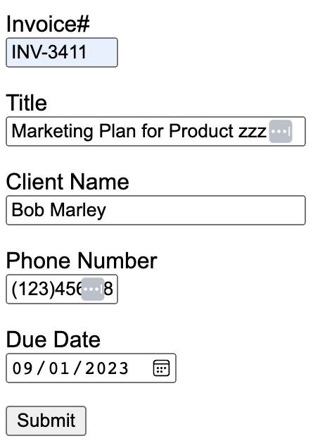
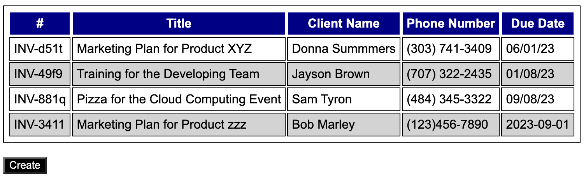

[](https://classroom.github.com/a/_oxHkT34)
# Overview

In class you were introduced to Flask, a lightweight framework for building web apps in Python. Flask documentation can be found [here](https://flask.palletsprojects.com/en/2.3.x/). In this homework assignment you are asked to incorporate templates and web forms processing to a simple web app. 

# Goal 

The web app you are asked to create is very simple. It constitutes of only 2 pages. The first one shows the list of invoices below: 


Users can then create new invoices using a simple form. 



The information entered updates the list of invoices. 



# Setup

Begin by creating a virtual environment under "venv".  Then install **flask** and **flask-wtf**. Set FLASK_APP environment variable to **invoices.py**. 

# Templates

Templates allows the separation of HTML and Python code. For example, the following template can be used to render the contents of **title** and **user** into the HTML code. 

```
<!DOCTYPE html>
<html>
    <head>
        <title>{{ title }}</title>
    </head>
    <body>
        <h1>Hello, {{ user }}!</h1>
    </body>
</html>
```

You can use the **render_template** function to display the web content above with specific values for **title** and **user**. 

```
from app import app
from flask import render_template

@app.route('/')
@app.route('/index')
def index():
    return render_template("index.html", title="CS 3250", user="Thyago")
```

Templates can use conditional statements, as shown by the example below. 

```
<!DOCTYPE html>
<html>
    <head>
        <title>{{ title }}</title>
    </head>
    <body>
        
            <h1>Hello, {{ user }}!</h1>
        
            <h1>Hello, World!</h1>
        
    </body>
</html>
```

The example below shows how loops can be incorporated in templates as well.

```
<!DOCTYPE html>
<html>
    <head>
        <title>{{ title }}</title>
    </head>
    <body>
        
            <h1>Hello, {{ user }}!</h1>
            <p>Classes that you will be teaching this semester:</p>
            
                <p>{{ class }}</p>
            
        
            <h1>Hello, World!</h1>
        
    </body>
</html>
```

To display the web content above with specific values for **title**, **user**, and **classes** you would do: 

```
from app import app
from flask import render_template

@app.route('/')
@app.route('/index')
def index():
    return render_template("index.html", title="CS 3250", user="Thyago", classes=['CS2050', 'CS3250'])
```

Templates can be easily extended using the following syntax: 

```

```

# Forms

Forms provide a way for users to communicate values to a web app. Support of web forms can be incorporated to Flask using an extension called Flask-WTF.  Flask extensions are Python packages that help you accomplish common tasks. Flask-WTF can be installed using: 

```
pip3 install flask-wtf
```

Below is an example of a web form with a text field and a submit button. 

```
from flask_wtf import FlaskForm
from wtforms import StringField, SubmitField
from wtforms.validators import DataRequired

class LoginForm(FlaskForm):
    user = StringField('User', validators=[DataRequired()])
    submit = SubmitField('Sign In')
```

There are many types of fields that can be used: IntegerField, StringField, DateField, SelectField, SubmitField, etc. Read Flask-WTF [documentation](https://flask-wtf.readthedocs.io/en/1.1.x/) to learn more about them. 

# TO-DOs

## TO-DO #1

In **index.html**, using a for loop, render invoice information using parameter "invoices". You are also expected to use a conditional statement to control the background of the table row. For example, if the variable **loop.index** is even, set the class attribute value to **even_row** and to **odd_row** otherwise. Those classes are defined in **static/style.css**. 

## TO-DO #2 

In **forms.py**, complete the invoice form with the missing fields (title, client name, phone number, and due date). Make sure to use appropriate data types for the fields. For example, due date should be of **DateField** type. 

## TO-DO #3

In **routes.py**, complete the "append" line with the missing fields that you are getting from the **form** object. 

## TO-DO #4 

In **invoices_create.html**, complete the form rendering with the missing fields. 

# Submission 

Once you are done completing all to-do's, submit all code changed using "final submission" as the commit message. 

# Rubric 

This homework is worth 5 points distributed like the following: 

+1 TO-DO #1 for loop 

+1 TO-DO #1 if statement 

+1 TO-DO #2

+1 TO-DO #3

+1 TO-DO #4


